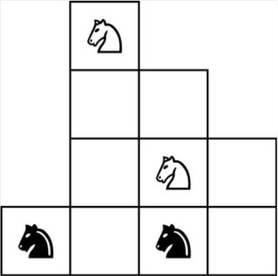
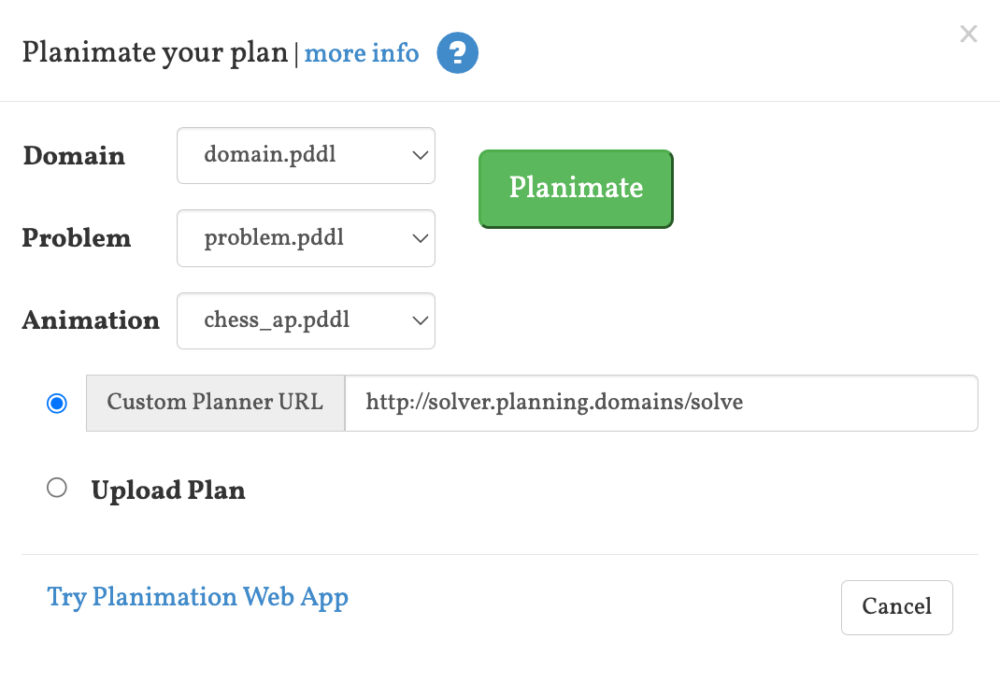

# Introduction

This is a second pass at the chess problem we solved [in Python](https://github.com/djiti/jh-chess-puzzle), using this time [domain independent planning](https://en.wikipedia.org/wiki/Automated_planning_and_scheduling) in [PDDL](https://planning.wiki).

Incidentally, this method runs a lot faster than the Python version (_on my computer_, tenths of seconds vs. 15-20 seconds).

Notice also that unlike ML-based approaches, actions are scrutable - meaning that human beings can understand why the planner chooses to do what it does.

# Files

The main three files of interest are:
- [domain.pddl](domain.pddl) that models a very much simplified game of chess, where we are only modeling pieces colors and movements.
- [problem.pddl](problem.pddl) that models the chess problem, and in particular
  - models the initial state of the chess board, square by square
  - models the moves that are allowed as knights
  - expresses the goal of switching the black and white knights
- [chess_ap.pddl](chess_ap.pddl) that models the visualization of the problem being solved.

This is a very quick attempt at modeling the domain and problem, both can surely be made a lot more elegant.

# Trying it out

- Go to the very good [PDDL Editor](http://editor.planning.domains/#read_session=rH3amyBfGm)
- You will find there the three files mentioned above. If they are missing, load them manually.

- Click on Solve, then Plan. You should see a plan come up on the left pane, `Plan (I)`, with a plan that solves the problem.
  

- Better yet, visualize the moves. The `Planimation` plugin should be loaded. If it is not, load it via the `Plugins` menu (yep, plugin loading fails sometimes). You should get this menu:
  
Click on `Planimation`, then `Planimate` leaving the default options
  
You should get this window:
  
  Click on "play" and enjoy

- Even better, watch the Heuristic function at work. Click on `HeurViz`, then `Go`. You should have a new file, `Statespace` on the left, go there. Click on `Compute All Heuristics` on the right. Notice how you can double-click on a node to search further and ask again to `Compute All Heuristics`, to see how the planner is progressing in the search space.
A tooltip will give you the heuristic on a node:
  

  # Going further

  - You can start by editing the PDDL files using the [PDDL Editor](http://editor.planning.domains/).

  - Next step, if you want to use new graphics, drop PNG files in the [img](img) folder then run `Make`. To get [Make](https://en.wikipedia.org/wiki/Make_(software)), either install it or use the [Devcontainer](https://code.visualstudio.com/docs/devcontainers/containers) configuration that is provided.
